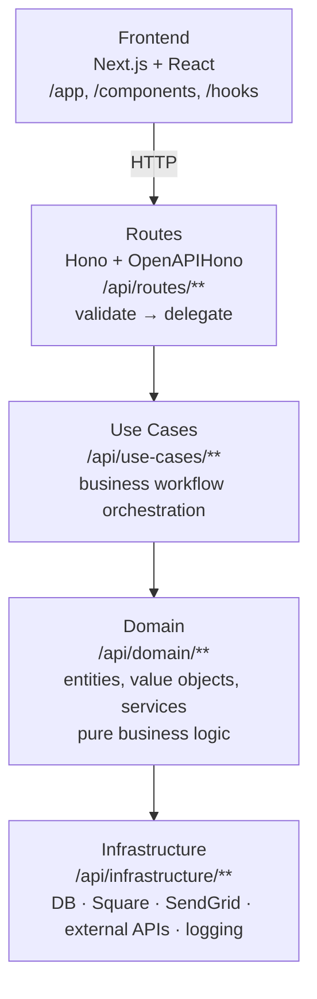

# Architecture

## Overview

CashOffers Billing is a full-stack application:
- **Backend**: Hono API (TypeScript) served as a Next.js API route
- **Frontend**: Next.js 16 + React 19

## Layers (Clean Architecture)



## Tech Stack

### Backend
| Layer | Technology |
|-------|-----------|
| Framework | Hono + OpenAPIHono |
| Database | MySQL + Kysely (type-safe SQL) |
| Payments | Square SDK |
| Email | SendGrid + React Email |
| Scheduling | Node.js cron |
| Config | dotenv + config service |
| Type Safety | TypeScript 5 |
| Testing | Vitest |

### Frontend
| Layer | Technology |
|-------|-----------|
| Framework | Next.js 16 + React 19 |
| Forms | React Hook Form |
| Server State | TanStack React Query |
| Styling | Tailwind CSS 4 |
| Payment UI | React Square Web Payments SDK |
| E2E Testing | Playwright |

## Module Aliases
- `@api/` → `api/` (backend imports)
- `@/` → root (frontend/Next.js convention)

## Key Patterns
- **No `process.env` in application code** — use `@api/config/config.service`
- **All amounts in cents**
- **Domain events** for cross-cutting concerns (6 handlers wired via in-memory event bus)
- **Repository pattern** for database access
- **Structured logging** with AsyncLocalStorage for request-scoped context

## Directory Map

```
/
├── api/                  # Backend
│   ├── app.ts            # Hono app + route mounting
│   ├── config/           # Config service, Square setup
│   ├── lib/              # DB instance, middleware, repos
│   ├── domain/           # Entities, value objects, services, events
│   ├── use-cases/        # Business workflows (71 files)
│   ├── infrastructure/   # DB repos, Square, SendGrid, APIs, logging
│   ├── routes/           # HTTP handlers (15 modules)
│   ├── application/      # Event handlers, service handlers, webhook handlers
│   ├── cron/             # Subscription renewal cron
│   ├── utils/            # Small helpers
│   └── tests/            # Unit + integration tests
├── app/                  # Next.js pages
├── components/           # React components
├── hooks/                # Custom React hooks
├── scripts/              # Dev CLI, SSH tunnel
└── docs/                 # This documentation
```
