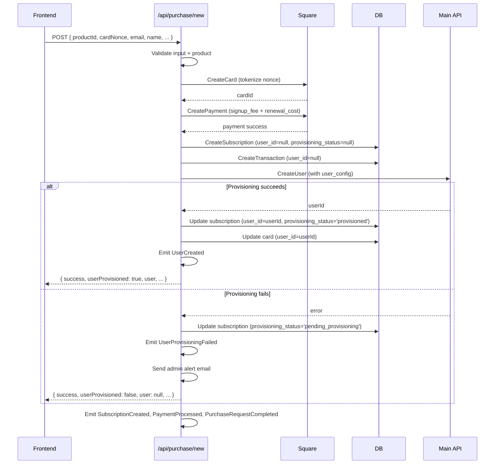
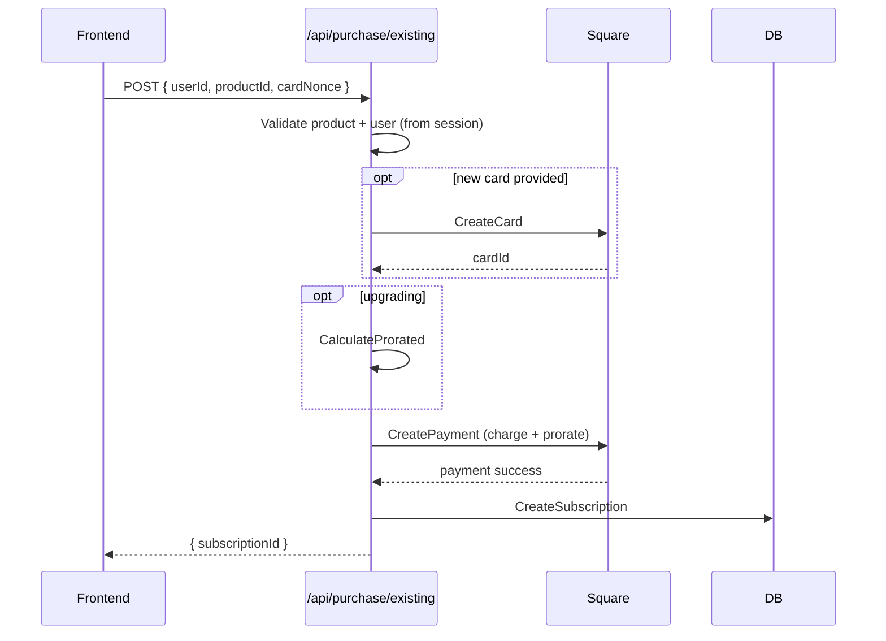

# Data Flow: Purchase

## New User Purchase

Payment-first architecture: the subscription is created before the user account.
If user provisioning fails, the subscription and transaction still exist — no refund
is issued, and the admin is alerted for manual intervention.

### Refund Logic

| Failure point | Refund? |
|---|---|
| Before payment (card creation, product validation) | N/A — nothing charged |
| Payment fails | N/A — Square did not complete |
| After payment, before subscription created | Yes — subscription does not exist yet |
| After subscription created (user provisioning, events) | **No** — subscription is the source of truth |

### Pending Provisioning

When `userProvisioned: false` is returned:
- The customer was charged and has a subscription record
- No user account exists yet — they cannot log in
- Admin receives an alert email with subscription ID, purchase request ID, and customer email
- A `UserProvisioningFailed` event is emitted for monitoring
- The subscription has `provisioning_status = 'pending_provisioning'` and `user_id = null`
- The cron job excludes these subscriptions from renewal processing

---

## Existing User Purchase

---

## Key Files

- `api/use-cases/subscription/purchase-new-user.use-case.ts`
- `api/use-cases/subscription/purchase-existing-user.use-case.ts`
- `api/routes/purchase/routes.ts`
- `api/database/migrations/007_subscriptions_nullable_user_id.sql`
- `api/domain/events/user-provisioning-failed.event.ts`
