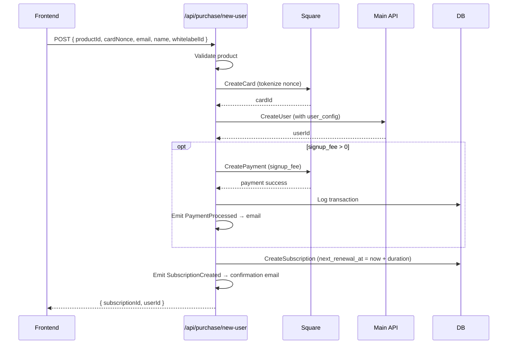
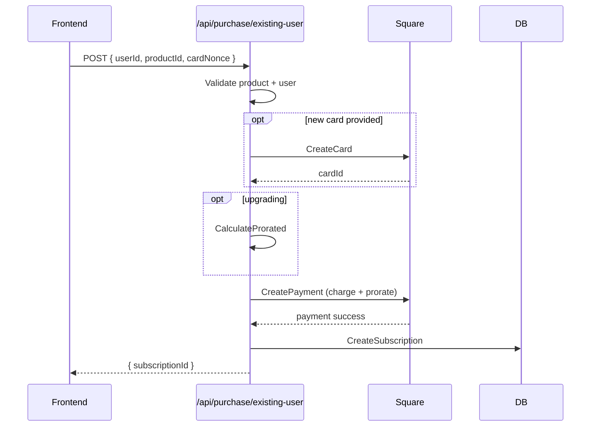

# Data Flow: Purchase

## New User Purchase

## Existing User Purchase

## Key Files
- `api/use-cases/subscription/purchase-new-user.use-case.ts`
- `api/use-cases/subscription/purchase-existing-user.use-case.ts`
- `api/routes/purchase/routes.ts`
