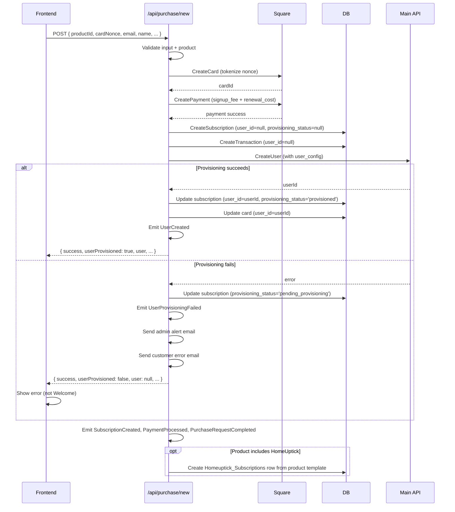
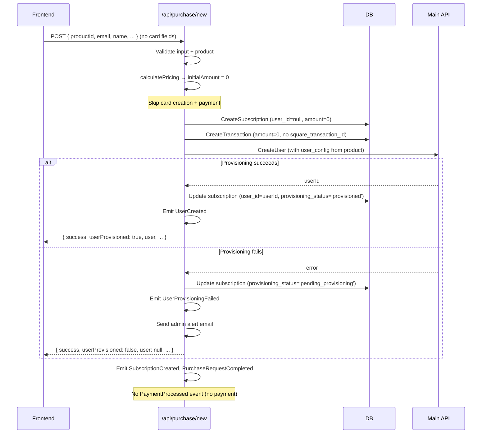
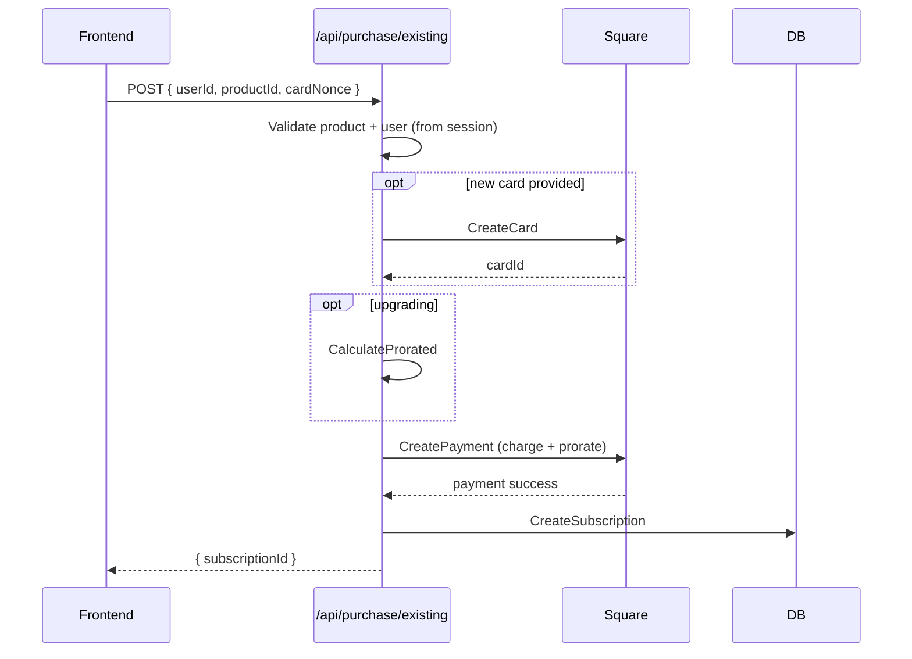

# Data Flow: Purchase

## New User Purchase

Payment-first architecture: the subscription is created before the user account.
If user provisioning fails, the subscription and transaction still exist — no refund
is issued, and the admin is alerted for manual intervention.

### Error Handling After Payment

| Failure point | Refund? | Action |
|---|---|---|
| Before payment (card creation, product validation) | N/A — nothing charged | Return error to frontend |
| Payment fails | N/A — Square did not complete | Return error to frontend |
| After payment, before subscription created | **No** | Admin manually provisions subscription + user |
| After subscription created (user provisioning, events) | **No** | Admin manually provisions user |

Payments are never automatically refunded. When a system error occurs after payment, the
purchase request record contains all context needed for manual resolution. Admin receives
a system error alert email; the customer receives an email confirming payment was received
and that the team is resolving the issue. Refunds are only issued manually by admin if
the issue cannot be resolved.

### Pending Provisioning

When `userProvisioned: false` is returned:
- The customer was charged and has a subscription record
- No user account exists yet — they cannot log in
- Admin receives an alert email with subscription ID, purchase request ID, and customer email
- **Customer receives an email** confirming payment was received and the team is resolving the issue
- The frontend shows an error message (not the Welcome step)
- A `UserProvisioningFailed` event is emitted for monitoring
- The subscription has `provisioning_status = 'pending_provisioning'` and `user_id = null`
- The cron job excludes these subscriptions from renewal processing

### System Error After Payment

When a system error (non-user-facing) occurs after payment was taken:
- Admin receives a system error alert email with full context for manual provisioning
- **Customer receives an email** notifying them of the issue and that the team is on it
- Payment is **not** refunded — admin manually provisions the subscription and user account

---

## Free Product Purchase ($0)

Free products (e.g., Free Agent, Free Investor) are real Product rows with `renewal_cost=0`
and `signup_fee=0`. They go through the same `POST /api/purchase/new` endpoint as paid
products — the backend detects the $0 amount and skips card/payment processing.

### Key Differences from Paid Purchase

| Aspect | Paid | Free ($0) |
|--------|------|-----------|
| Card fields in request | Required | Omitted |
| Square card creation | Yes | Skipped |
| Square payment | Yes | Skipped |
| Transaction record | square_transaction_id populated | square_transaction_id = null |
| Subscription created email | Sent | Suppressed (amount = 0) |
| Renewal email | Sent | Suppressed (amount = 0) |
| Renewal cron | Charges + advances date | Advances date only (no charge) |

### Frontend Behavior

The frontend uses `isProductFree()` (from `ProductProvider`) to detect $0 products based
on product data — not magic strings. When a product is free:
- The card step is automatically skipped
- The review step shows $0 pricing
- No card nonce is submitted

---

## Existing User Purchase

---

## HomeUptick Subscription Seeding

When a product includes HomeUptick (`Products.data.homeuptick.enabled = true`), the purchase flow creates a `Homeuptick_Subscriptions` row seeded from the product template:

| Product template field | → | Homeuptick_Subscriptions column |
|---|---|---|
| `homeuptick.base_contacts` | → | `base_contacts` |
| `homeuptick.contacts_per_tier` | → | `contacts_per_tier` |
| `homeuptick.price_per_tier` | → | `price_per_tier` |
| `homeuptick.free_trial.contacts` | → | `free_trial_contacts` |
| `homeuptick.free_trial.duration_days` | → | `free_trial_days` |
| computed from duration_days | → | `free_trial_ends` |

The `Homeuptick_Subscriptions` row is the live source of truth for HU config. The product JSON is just the template. See [HomeUptick Data Ownership](../../business/decisions/homeuptick-data-ownership).

---

## Key Files

- `api/use-cases/subscription/purchase-new-user.use-case.ts`
- `api/use-cases/subscription/purchase-existing-user.use-case.ts`
- `api/routes/purchase/routes.ts`
- `api/database/migrations/007_subscriptions_nullable_user_id.sql`
- `api/domain/events/user-provisioning-failed.event.ts`
