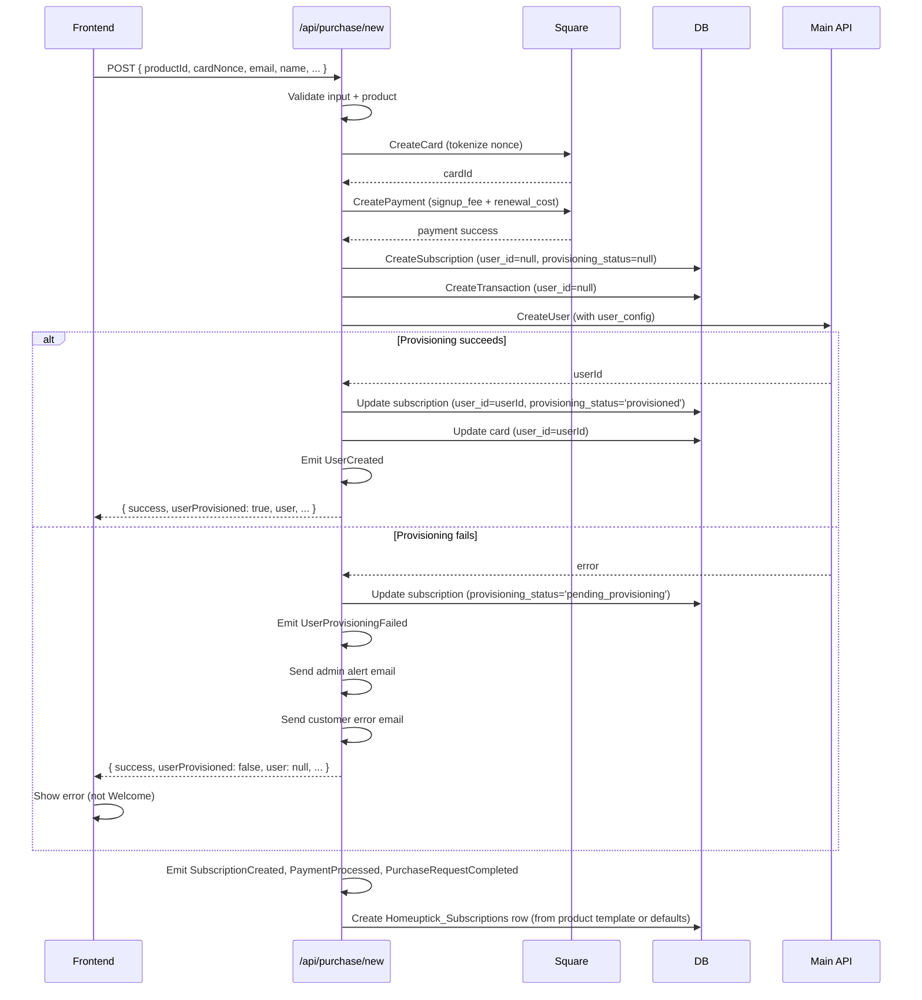
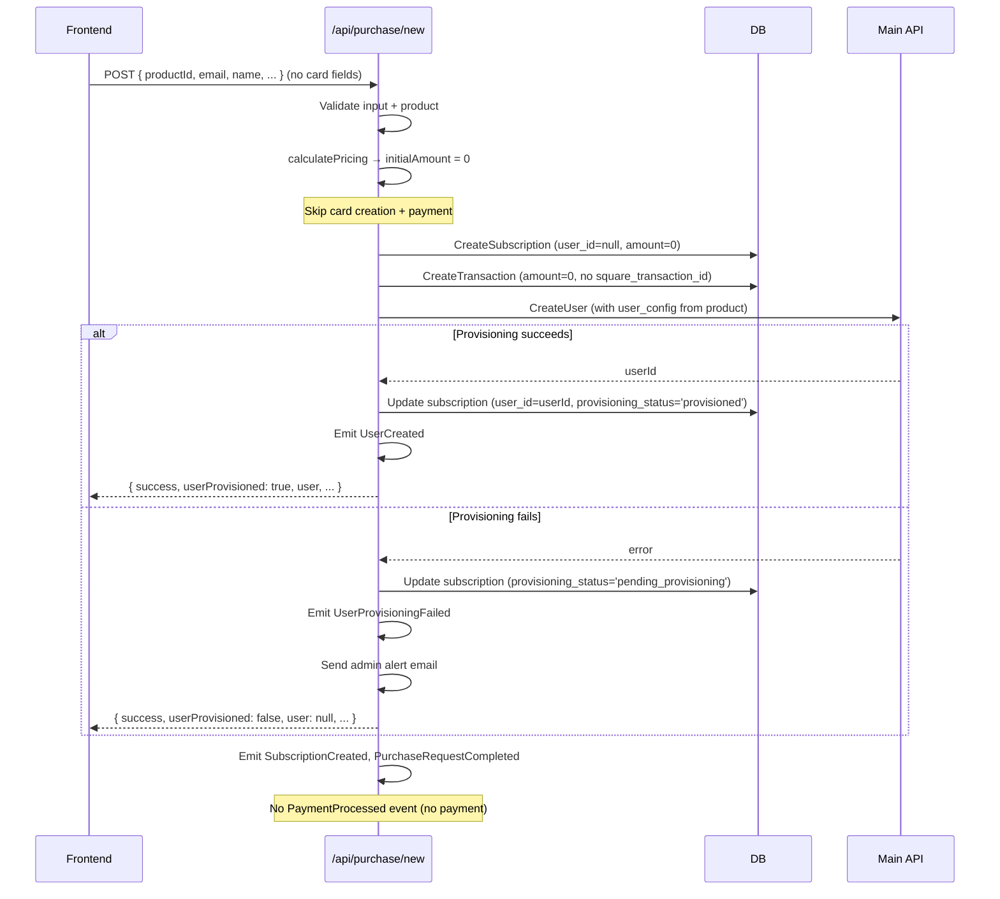
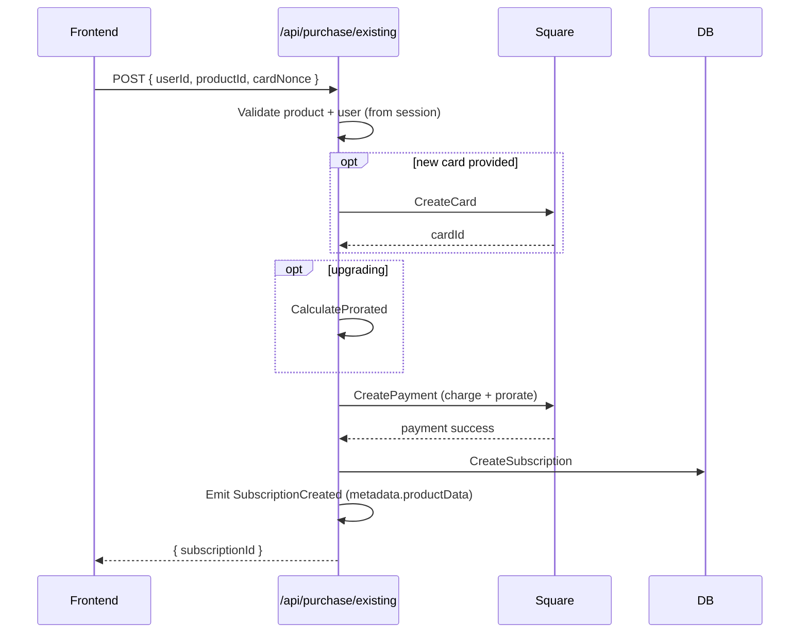

# Data Flow: Purchase

## New User Purchase

Payment-first architecture: the subscription is created before the user account.
If user provisioning fails, the subscription and transaction still exist — no refund
is issued, and the admin is alerted for manual intervention.


```mermaid
sequenceDiagram
  participant FE as Frontend
  participant API as /api/purchase/new
  participant Square
  participant DB
  participant MainAPI as Main API

  FE->>API: POST { productId, cardNonce, email, name, ... }
  API->>API: Validate input + product
  API->>Square: CreateCard (tokenize nonce)
  Square-->>API: cardId
  API->>Square: CreatePayment (signup_fee + renewal_cost)
  Square-->>API: payment success
  API->>DB: CreateSubscription (user_id=null, provisioning_status=null)
  API->>DB: CreateTransaction (user_id=null)
  API->>MainAPI: CreateUser (with user_config)
  alt Provisioning succeeds
    MainAPI-->>API: userId
    API->>DB: Update subscription (user_id=userId, provisioning_status='provisioned')
    API->>DB: Update card (user_id=userId)
    API->>API: Emit UserCreated
    API-->>FE: { success, userProvisioned: true, user, ... }
  else Provisioning fails
    MainAPI-->>API: error
    API->>DB: Update subscription (provisioning_status='pending_provisioning')
    API->>API: Emit UserProvisioningFailed
    API->>API: Send admin alert email
    API->>API: Send customer error email
    API-->>FE: { success, userProvisioned: false, user: null, ... }
    FE->>FE: Show error (not Welcome)
  end
  API->>API: Emit SubscriptionCreated, PaymentProcessed, PurchaseRequestCompleted
  API->>DB: Create Homeuptick_Subscriptions row (from product template or defaults)
```

### Hidden Plans (Direct Purchase Links)

A plan flagged `data.hidden = true` (or hidden from a whitelabel via
`data.hidden_whitelabels`) is kept out of the plan lists but stays on sale through the
direct purchase link an admin shares — `/{whitelabel_code}/subscribe/{product_id}`.

The signup flow resolves that link against `GET /signup/products`, so the request carries
`?product=<id>`: the list stays filtered, and only the one named id is exempt from the
hiding rules. The caller has to already know the id, so the exemption cannot be used to
enumerate hidden plans. Without the parameter a hidden plan cannot be resolved and the
flow reports "Invalid product ID".

### Error Handling After Payment

| Failure point | Refund? | Action |
|---|---|---|
| Before payment (card creation, product validation) | N/A — nothing charged | Return error to frontend |
| Payment fails | N/A — Square did not complete | Return error to frontend |
| After payment, before subscription created | **No** | Admin manually provisions subscription + user |
| After subscription created (user provisioning, events) | **No** | Admin manually provisions user |

Payments are never automatically refunded. When a system error occurs after payment, the
purchase request record contains all context needed for manual resolution. Admin receives
a system error alert email; the customer receives an email confirming payment was received
and that the team is resolving the issue. Refunds are only issued manually by admin if
the issue cannot be resolved.

### Pending Provisioning

When `userProvisioned: false` is returned:
- The customer was charged and has a subscription record
- No user account exists yet — they cannot log in
- Admin receives an alert email with subscription ID, purchase request ID, and customer email
- **Customer receives an email** confirming payment was received and the team is resolving the issue
- The frontend shows an error message (not the Welcome step)
- A `UserProvisioningFailed` event is emitted for monitoring
- The subscription has `provisioning_status = 'pending_provisioning'` and `user_id = null`
- The cron job excludes these subscriptions from renewal processing

### System Error After Payment

When a system error (non-user-facing) occurs after payment was taken:
- Admin receives a system error alert email with full context for manual provisioning
- **Customer receives an email** notifying them of the issue and that the team is on it
- Payment is **not** refunded — admin manually provisions the subscription and user account

---

## Free Product Purchase ($0)

Free products (e.g., Free Agent, Free Investor) are real Product rows with `renewal_cost=0`
and `signup_fee=0`. They go through the same `POST /api/purchase/new` endpoint as paid
products — the backend detects the $0 amount and skips card/payment processing.


```mermaid
sequenceDiagram
  participant FE as Frontend
  participant API as /api/purchase/new
  participant DB
  participant MainAPI as Main API

  FE->>API: POST { productId, email, name, ... } (no card fields)
  API->>API: Validate input + product
  API->>API: calculatePricing → initialAmount = 0
  Note over API: Skip card creation + payment
  API->>DB: CreateSubscription (user_id=null, amount=0)
  API->>DB: CreateTransaction (amount=0, no square_transaction_id)
  API->>MainAPI: CreateUser (with user_config from product)
  alt Provisioning succeeds
    MainAPI-->>API: userId
    API->>DB: Update subscription (user_id=userId, provisioning_status='provisioned')
    API->>API: Emit UserCreated
    API-->>FE: { success, userProvisioned: true, user, ... }
  else Provisioning fails
    MainAPI-->>API: error
    API->>DB: Update subscription (provisioning_status='pending_provisioning')
    API->>API: Emit UserProvisioningFailed
    API->>API: Send admin alert email
    API-->>FE: { success, userProvisioned: false, user: null, ... }
  end
  API->>API: Emit SubscriptionCreated, PurchaseRequestCompleted
  Note over API: No PaymentProcessed event (no payment)
```

### Key Differences from Paid Purchase

| Aspect | Paid | Free ($0) |
|--------|------|-----------|
| Card fields in request | Required | Omitted |
| Square card creation | Yes | Skipped |
| Square payment | Yes | Skipped |
| Transaction record | square_transaction_id populated | square_transaction_id = null |
| Subscription created email | Sent | Suppressed (amount = 0) |
| Renewal email | Sent | Suppressed (amount = 0) |
| Renewal cron | Charges + advances date | Advances date only (no charge) |

### Frontend Behavior

The frontend uses `isProductFree()` (from `ProductProvider`) to detect $0 products based
on product data — not magic strings. When a product is free:
- The card step is automatically skipped
- The review step shows $0 pricing
- No card nonce is submitted

---

## Existing User Purchase

> **Note:** `external_cashoffers` products are purchased exclusively through this flow (`POST /api/purchase/existing`), not through the new user signup flow. The main signup page (`GET /signup/products`) excludes `external_cashoffers` products entirely. These products are for users who already have an externally-managed CO account and need to enroll in HU via the manage billing section.

### Direct Product Links for Existing Users (Manage Flow)

`/{whitelabel_code}/subscribe/{product_id}` only creates accounts, so an existing user is sent
to one product through the manage flow instead. The CashOffers dashboard's upgrade link
(`/api/v2/signup/upgrade/redirect` in the main app) builds:

```
{SIGNUP_URL}/manage?t=<jwt>&goto=<enrollment|changePlan>&product=<product_id>
```

- `goto=enrollment` when the user has no `active`, `trial` or `paused` subscription;
  `goto=changePlan` when they have one.
- `product` survives the `t` token strip (only `t`/`token` are removed from the URL) and the
  email/password login steps, and `ManageFlow` passes it to `EnrollmentStep` and `UpdatePlanStep`.
- **Enrollment** calls `GET /manage/enrollment?product=<id>`. The response lists exactly that
  product and the single-product auto-select goes straight to payment, which is
  `POST /purchase/existing`.
- **Change plan** calls `GET /manage/products?product=<id>`, then preselects it (the
  `checkplan` review), and the change goes through `POST /manage/purchase`.

**The link rule** (`api/domain/services/product-link.service.ts`). A named product is
returned only when it exists, is a `subscription` product, and its `whitelabel_code` equals
the user's white label code **exactly**. `data.hidden` and `data.hidden_whitelabels` are not
consulted, because an explicit link is how a hidden plan is sold. NULL matches only NULL: a
NULL-white-label product is the platform's own plan, so it resolves only for a user whose white
label has no code (or who has no white label). An upgrade link for an eXp agent must never land
on a CashOffers tier. Otherwise the answer is `PRODUCT_NOT_AVAILABLE`, 404 for a missing
product and 403 for the rest, and it never falls back to the category list. Without
`product`, both endpoints behave exactly as before.

**The purchase guard** is looser on purpose. `POST /purchase/existing`, `POST /manage/checkplan`
and `POST /manage/purchase` refuse only a product that belongs to **another** white label
(403 `PRODUCT_NOT_AVAILABLE`). Shared NULL products stay purchasable by everyone, because the
plan lists have always offered them. The guard stops a hand-edited `product_id`.

### Enrollment Intent and Express Offers Guests

`GET /manage/enrollment` decides once what the enrollment is for and returns it as `intent`
beside the products (`api/domain/services/enrollment-intent.service.ts`):

| Scenario                                               | `product_category`         | `intent`              |
| ------------------------------------------------------ | -------------------------- | --------------------- |
| `?product=<id>` (direct product link)                  | the product's              | `buy_product`         |
| Express Offers Guest, one upgrade product found        | the product's              | `buy_product`         |
| Express Offers Guest, zero or several upgrade products | `null` (`eligible: false`) | `null`                |
| `?category=premium_cashoffers`                         | `premium_cashoffers`       | `buy_product`         |
| `is_premium = 1` (or `?category=external_cashoffers`)  | `external_cashoffers`      | `activate_homeuptick` |
| Otherwise (or `?category=homeuptick_only`)             | `homeuptick_only`          | `homeuptick_only`     |

The decision reads the user's `role_v2` from the main API (`GET /users/:id`; the auth context
carries only the legacy `role`). A failed lookup is an error response, never a guess, because
the legacy fallback reads a Guest as a free agent.

**The Guest rule.** An Express Offers Guest (`role_v2 = AGENT_EXP_GUEST`) has no HomeUptick
access, so plain `/manage` sends them to their upgrade: the one `subscription` product in their
white label (exact `whitelabel_code`, NULL only for NULL) whose
`data.cashoffers.user_config.role_v2` is `AGENT_EXP_PRO`. This mirrors the api-v2 upgrade link's
resolver. The Guest-to-Pro mapping is `UPGRADE_TARGET_ROLE_V2`, the one place billing states it.
Zero or several matches answer `eligible: false` with no products, and the account site lands on
the dashboard. A Guest is never offered a `homeuptick_only` product on any path: their
`?category=homeuptick_only` is ignored, a product link to one is 403 `PRODUCT_NOT_AVAILABLE`, and
`GET /manage/products` leaves them out of the list (and leaves them out for everyone when the role
cannot be read, rather than failing the whole list).

**Role write.** The existing-user flow attaches `productData` to `SubscriptionCreated` as
`metadata.productData`. `CashOffersAccountHandler.handleCreated` reads the product config only
from there. With `cashoffers.managed = true` and `userWasCreated = false`, it compares the user's
`role_v2` with the product's and calls `updateUser({ role_v2, whitelabel_id })`, which goes to
`PUT /users/:id/role`. So an Express Offers Guest who buys Express Offers Pro becomes
`AGENT_EXP_PRO`. Before this, the event carried no product data, and an existing user's
purchase wrote no role at all. A plan change publishes `SubscriptionUpgraded` with
`toProductData`, and `handleUpgraded` writes the role the same way.

### Existing User Purchase Flow


```mermaid
sequenceDiagram
  participant FE as Frontend
  participant API as /api/purchase/existing
  participant Square
  participant DB

  FE->>API: POST { userId, productId, cardNonce }
  API->>API: Validate product + user (from session)
  opt new card provided
    API->>Square: CreateCard
    Square-->>API: cardId
  end
  opt upgrading
    API->>API: CalculateProrated
  end
  API->>Square: CreatePayment (charge + prorate)
  Square-->>API: payment success
  API->>DB: CreateSubscription
  API->>API: Emit SubscriptionCreated (metadata.productData)
  API-->>FE: { subscriptionId }
```

---

## HomeUptick Subscription Seeding

Every purchase seeds a `Homeuptick_Subscriptions` row. If the product has explicit HomeUptick config (`Products.data.homeuptick.enabled = true`), it uses the product template. Otherwise, default values are applied (500 base contacts, 500 contacts/tier, $0/tier):

| Product template field | → | Homeuptick_Subscriptions column |
|---|---|---|
| `homeuptick.base_contacts` | → | `base_contacts` |
| `homeuptick.contacts_per_tier` | → | `contacts_per_tier` |
| `homeuptick.price_per_tier` | → | `price_per_tier` |
| `homeuptick.free_trial.contacts` | → | `free_trial_contacts` |
| `homeuptick.free_trial.duration_days` | → | `free_trial_days` |
| computed from duration_days | → | `free_trial_ends` |

The `Homeuptick_Subscriptions` row is the live source of truth for HU config. The product JSON is just the template. See [HomeUptick Data Ownership](../../business/decisions/homeuptick-data-ownership).

---

## Key Files

- `api/use-cases/subscription/purchase-new-user.use-case.ts`
- `api/use-cases/subscription/purchase-existing-user.use-case.ts`
- `api/routes/purchase/routes.ts`
- `api/database/migrations/007_subscriptions_nullable_user_id.sql`
- `api/domain/events/user-provisioning-failed.event.ts`
