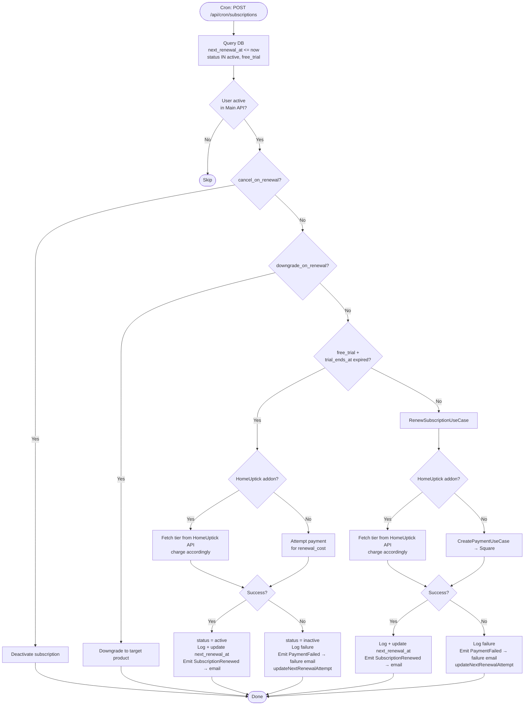

# Data Flow: Subscription Renewal

## Trigger
External scheduler → POST `/api/cron/subscriptions` with `CRON_SECRET` header

## Flow

## Retry Schedule
| Failure | Next attempt |
|---------|-------------|
| 1st | +1 day |
| 2nd | +3 days |
| 3rd | +7 days |
| 4th | suspend (not yet automated) |

## Key Files
- `api/cron/subscriptionsCron.ts`
- `api/use-cases/subscription/renew-subscription.use-case.ts`
- `api/routes/cron/routes.ts`
