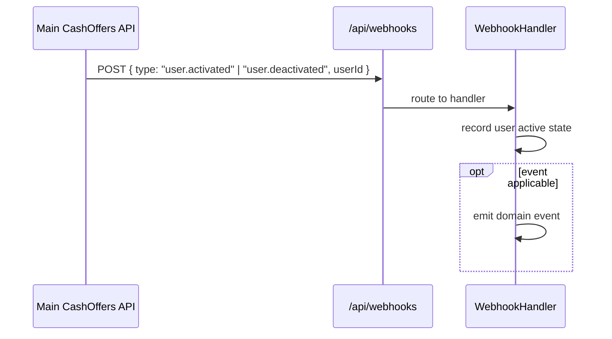

# Data Flow: Webhooks

## CashOffers Webhook (User Activation/Deactivation)

**Effect on renewals**: The cron job reads user `active` status from the main API at renewal time. A deactivated user is skipped.

## Key Files
- `api/routes/webhooks/routes.ts`
- `api/application/webhook-handlers/`
- `api/tests/integration/webhook-cashoffers.test.ts`

## Square Webhooks

Square sends payment events (payment completed, refunded, etc.) to a configured endpoint. Current status of Square webhook handler is unclear — see [Discrepancies](../../development/quality/discrepancies).
